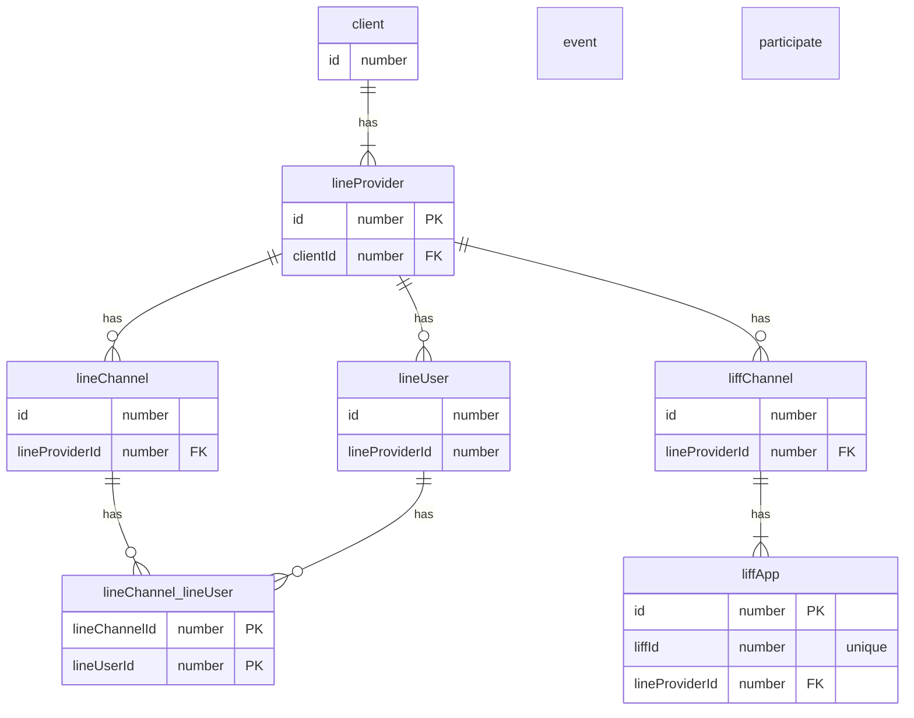

client

### 全体の DB 設計

```mermaid
erDiagram

client{
  id number
}

%%-- lineアカウント関連始まり --%%
lineProvider{
  id number PK
  clientId number FK
}

lineChannel{
  id number
  lineProviderId number FK
}

liffChannel{
  id number
  lineProviderId number FK
}

%% liffChannelが作成されたら自動で作成する。
liffApp{
  id number PK
  liffId number "unique"
  lineProviderId number FK
}

lineChannel_lineUser{
  lineChannelId number PK
  lineUserId number PK
}

lineUser{
  id number
  lineProviderId number
}

client ||--|{ lineProvider :has
lineProvider ||--o{ lineChannel :has
lineProvider ||--o{ liffChannel : has
lineProvider ||--o{ lineUser: has
lineChannel ||--o{ lineChannel_lineUser :has
lineUser ||--o{ lineChannel_lineUser :has
liffChannel ||--|{ liffApp :has


%%-- lineアカウント関連終わり --%%


%%-- event関連始まり(まだ全体像未定) --%%
event

participate

%%-- event関連終わり(まだ全体像未定) --%%

```

### メモ

-
