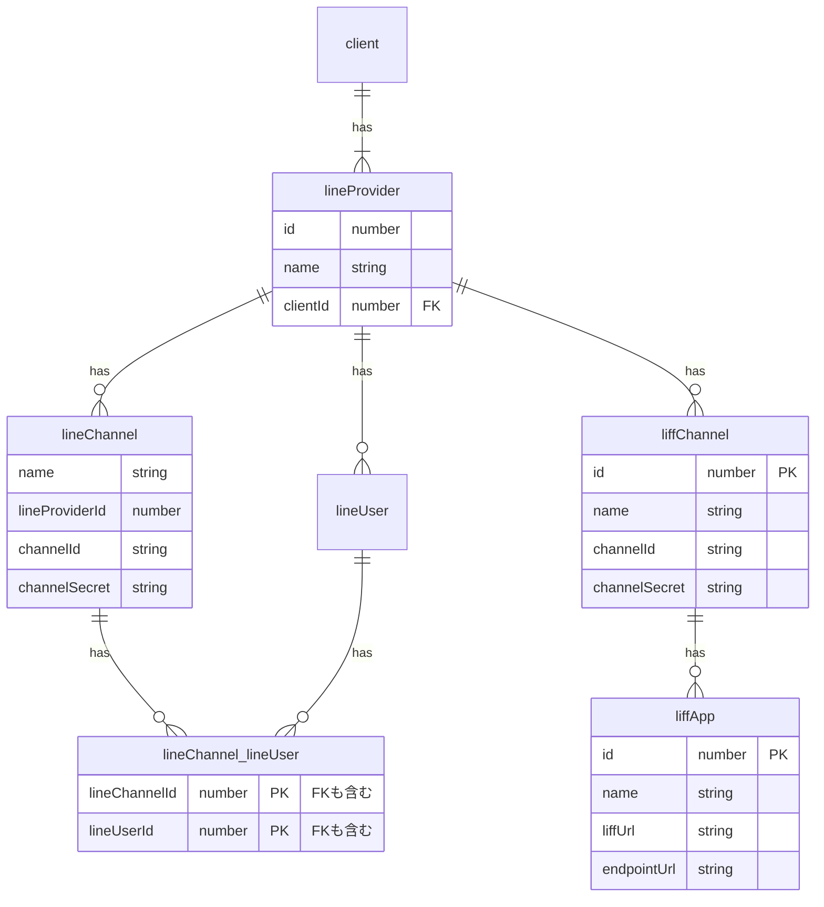

### LINE アカウント関連

### 思考メモ

[問題]

- そのユーザーが参加しているイベントを lineProvider 関係なく、横断的に見たい要件が考えられる。
  - user(サービスに対して、一意なユーザー) 1 : 多 lineUser(lineProviderId に紐づくユーザー情報)
  - 最初から紐付けるのは自動で無理っぽいな。
  - メールアドレスとパスワードでの管理が必要になってくる
  - line アカウントの強みがない。
  - 一意な ID 発行して、サービス用の LINE アカウントで登録すると見れるよ。みたいなのがいいのかも
  - stripe の CustomerId どうするか問題はある。

[結論]

- サービスが複雑になるのを防ぐ。Google カレンダーなどに連携するなど別の要件で対応する。
